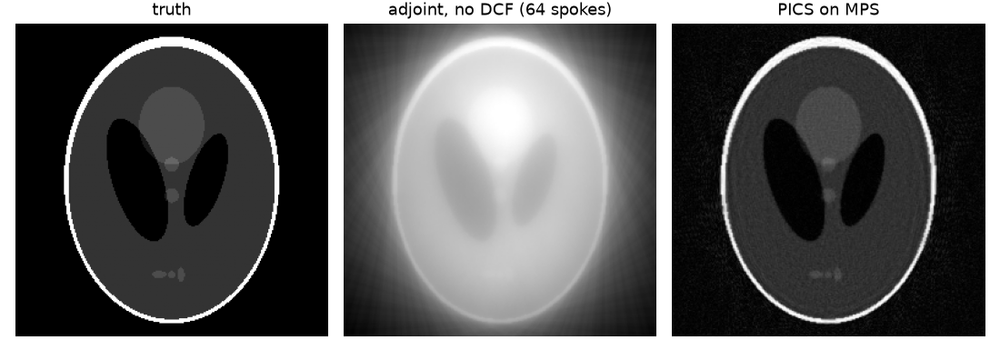

# MRI reconstruction on Apple-silicon GPUs

How to make MRI reconstruction code in Python run on the GPU of a Mac (M1-M4),
with **PyTorch (MPS)** and **Apple MLX**, step by step:

| # | Script | What | Measured on an M4 Pro |
|---|---|---|---|
| 01 | [`01_fft_benchmark.py`](01_fft_benchmark.py) | multi-coil 2D FFT (Cartesian recon) | 20 frames x 16 coils x 256²: NumPy 129 ms -> MPS **8.9 ms (x14)**, MLX 12.8 ms (x10) |
| 02 | [`02_nufft_mlx.py`](02_nufft_mlx.py) | Kaiser-Bessel NUFFT in MLX and PyTorch | radial, 206k samples x 16 coils, fwd+adj: NumPy 533 ms -> MLX **66 ms (x8)**, MPS 99 ms (x5) |
| 03 | [`03_pics_toeplitz_mps.py`](03_pics_toeplitz_mps.py) | non-Cartesian PICS with a Toeplitz operator | 60 FISTA iterations, 12 coils, 256²: CPU 2.25 s -> MPS **0.12 s (x18)** |

Accuracy is checked in every script: NUFFT vs exact DFT 7e-6, adjoint test 4e-6,
Toeplitz vs NUFFT normal operator 6e-6, CPU vs GPU result 2e-5 (float32).


*64 radial spokes (6x below Nyquist), 12 coils: adjoint vs L1-wavelet PICS, 120 ms on the GPU.*

```bash
pip install -r requirements.txt
python 01_fft_benchmark.py
python 02_nufft_mlx.py
python 03_pics_toeplitz_mps.py
```
Your numbers will differ with the chip; the ratios are what matters.

---

## 01 - FFT: the easy win
A Cartesian reconstruction is one centred IFFT per coil and frame. Moving the
array to the GPU (`tensor.to("mps")` or `mx.array(...)`) and calling the same FFT
gives x10-x15. Two rules for honest timings:
* GPU calls are **asynchronous**: call `torch.mps.synchronize()` / `mx.eval()` before stopping the clock.
* The first call compiles kernels: **warm up** first.

## 02 - NUFFT in MLX
[`nufft.py`](nufft.py) builds a Kaiser-Bessel plan once in NumPy (6x6
neighbours, 2x oversampled grid, Beatty's beta). Applying it is only

* forward: deapodise -> pad -> FFT -> **gather** 36 neighbours and sum
* adjoint: **scatter-add** onto the grid -> IFFT -> crop -> deapodise

and gather/scatter are exactly what GPUs do well ([`gpu_ops.py`](gpu_ops.py): `mx.take` /
`.at[].add` in MLX, `index_select` / `index_add_` in PyTorch). All coils go
through in one batch.

Things that bite on the Apple GPU:
* **No float64.** Everything is complex64/float32; check accuracy against a double-precision reference once.
* **No complex scatter** (MLX today): scatter the real and imaginary parts as float32 and recombine.
* Keep the plan on the GPU and the data there between iterations: the host<->GPU copy costs more than the NUFFT.

## 03 - Toeplitz PICS on MPS
An iterative recon only needs the normal operator A^H A. For a NUFFT it is a
convolution with the point-spread function, so on a 2x grid

```
A^H A x = crop( IFFT( T * FFT( pad(x) ) ) ),   T = FFT(psf)   (psf = adjoint NUFFT of ones, computed once)
```

Each iteration is then coil maps -> FFT -> multiply -> IFFT -> coil combine,
with no gridding at all. FISTA with an L1-Haar wavelet (cycle spinning) runs the
same code on the CPU and on the GPU; only `device` changes.

When the Toeplitz trick does *not* help: when the operator changes every
iteration (e.g. off-resonance with time segmentation needs one kernel per
segment) or when the 2x grid no longer fits in memory (large 3D).

## General tips
* Batch everything (coils, frames, slices) into one array: GPU kernels have a fixed launch cost.
* Avoid `.item()`, `print(tensor)` and NumPy conversions inside loops: each one forces a GPU sync.
* PyTorch MPS and MLX are both good; MLX is lazier (builds a graph, runs on `mx.eval`) and was faster for scatter-heavy code here, MPS for plain FFTs.
* Set `PYTORCH_ENABLE_MPS_FALLBACK=1` while porting, then remove it: silent CPU fallbacks are slow.

## Files
```
nufft.py        Kaiser-Bessel NUFFT plan + NumPy reference + exact DFT + radial trajectory
gpu_ops.py      the plan on the GPU: NufftMLX, NufftTorch
phantom.py      Shepp-Logan + simulated coil maps
01..03_*.py     the three examples
```

## Requirements
macOS on Apple silicon, Python >= 3.10, numpy, matplotlib, torch >= 2.3, mlx >= 0.20.
Script 03 does not need MLX and also runs on a CPU-only machine (the GPU timing is then skipped).

## Acknowledgements
This work stands on open-source MRI and NUFFT software, and I am grateful to their authors:

* [MRI-NUFFT](https://github.com/mind-inria/mri-nufft): a unified Python interface to NUFFT back ends for MRI
* [SigPy](https://github.com/mikgroup/sigpy): signal processing and iterative MRI reconstruction in Python
* [BART](https://github.com/mrirecon/bart): the Berkeley Advanced Reconstruction Toolbox
* [mlx-nufft](https://github.com/martinlachaine/mlx-nufft): non-uniform FFTs on Apple GPUs via Metal/MLX
* [FINUFFT](https://github.com/flatironinstitute/finufft): the Flatiron Institute non-uniform FFT library

## Licence
MIT
